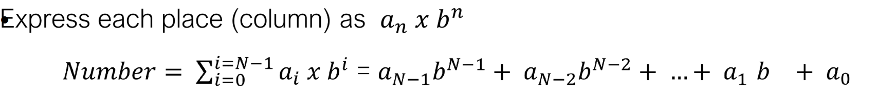
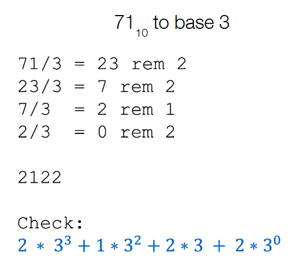
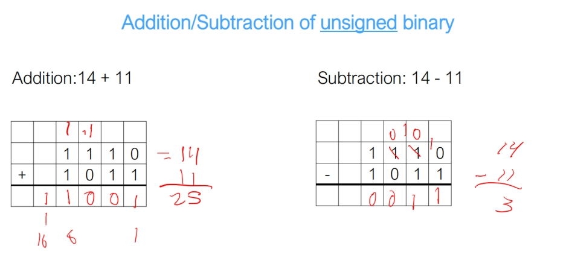
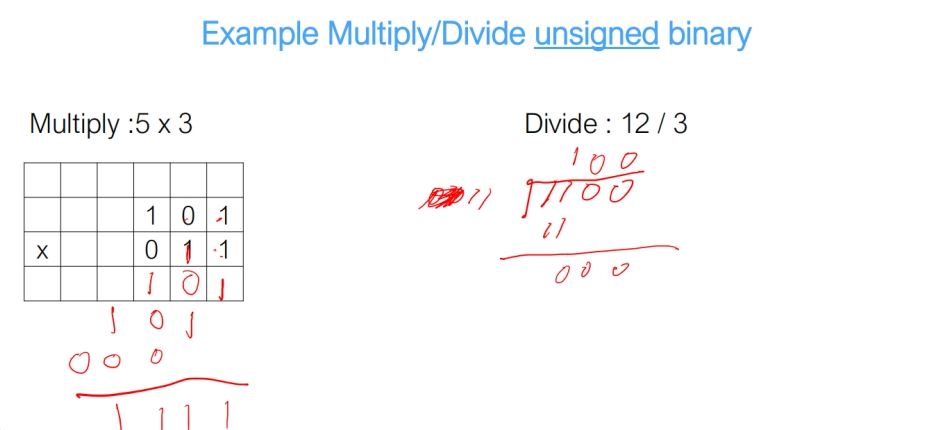
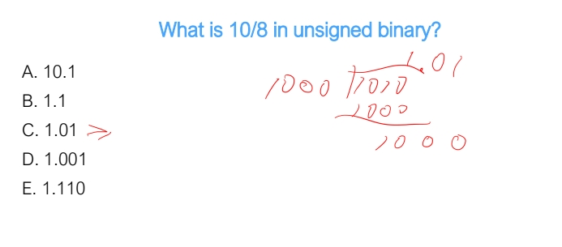
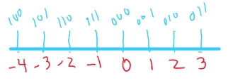
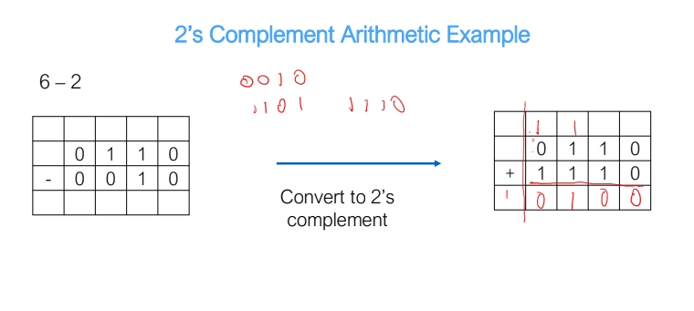
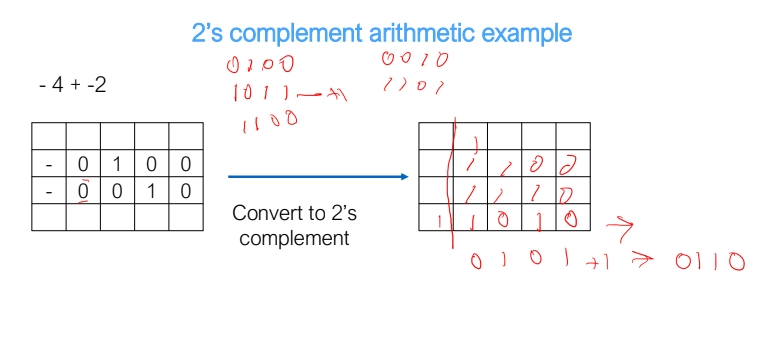
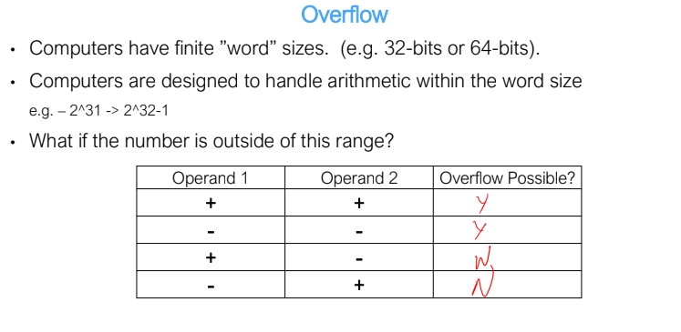
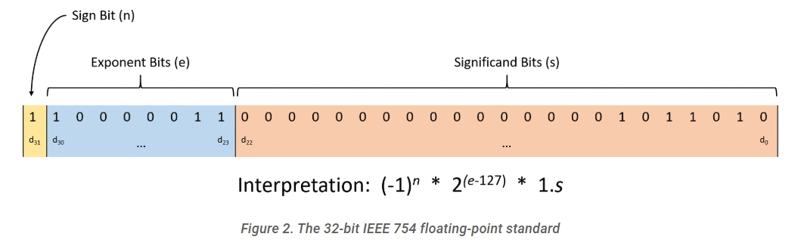

# Homework 0 Contents
topics include binary number representation and base conversion, unsigned numbers, fractions, 2's complement, overflow, fixed point representation, IEEE 754 standard.

## Binary Number Representation and Base conversion
* convert different bases formula
    
* converting base 2 floating point decimal to base 10:
    1. 10001.11 -> 2^4 + 2^0 + 2^-1 + 2^-2 = 17.75
* binary range:
    1. with X bits, we can enumerate 2^X unique numbers
* largest base we can work in with symbols of length X:
    1. X length strings need bases of X to represent
* convert hex to binary
    1. 0x51 = 0b 1001 0001
    2. from binary to hex, group 4 of them as one and convert each group to the corresponding hex digit
        0,1,2,3,4,5,6,7,8,9,,A,B,C,D,E,F.
* most significant bit is the left most bit, least significant bit is the right most bit
* shift: 
    1. times 2 -> left shift by 1 bit
    2. divided by 2 -> right shift by 1 bit
* Convert from base 10 to any base  
    

## Unsigned numbers
* unsigned binary to decimal, just treat the most significant bit as positive and add them up
    1. 11111100 = 11111100 = (1\*2^7) + (1\*2^6) + (1\*2^5) + (1\*2^4) + (1\*2^3) + (1\*2^2) + (0\*2^1) + (0\*2^0) = 252
* unsigned binary to hex, just group them by 4
    1. 00011101 to hex, 0001 = 1, 1101 = D, 00011101 = 1D.
* Unsigned Addition/Subtraction/Multiplication/Division
    
    

## Fraction
* Fraction division:  
    

## 2's complement
* X bits 2's complement representation can represent -2^(n-1) to 2^(n-1) - 1
    1. for example , 3 bits can represent  
    
* convert -25 to 6 bit 2's complement representation:
    1. 25 in binary is 011 001
    2. take 2's complement -> flip 1 to 0, 0 to 1, then finally add 1, we get 100 110, plus 1 to be 100 111(final result)
* From 2's complement to decimal, treat the most significant bit as negative
    1. Given 100 111, it's 1\*2^0 + 1*2^1 + 1\*2^2 + 0\*2^3 + 0\*2^4 - 1\*2^5 = -25
* 2's complement subtractions
    1. convert negative numbers to 2's complement representation, and use addition
    
    

## Overflow
* Addition: if two numbers have the same sign(most significant bits are the same), and carry in does not equal to carry out, then it overflows

* Subtraction: does not overflow

## Fixed point representation(Unsigned)
* 100.101, 100 = 4, 101 = 5, 100.101 = 4.5
* 4.5, 4 = 100, 5 = 101, 4.5 = 100.101 

## IEEE 754 standard
* Rules:
    
    1. The low-order 23 bits (digits d22 through d0) represent the fraction part
    2. The next eight bits (digits d30 through d23) represent the exponent
    3. The final high-order bit (digit d31) represents the sign bit, positive is 0, negative is 1
    4. It's always 1 point something, so no need to record
    5. Example of 0b11000001101101000000000000000000
        * Fraction portion: 01101000000000000000000, which represents 2^-2 + 2^-3 + 2^-5 = 0.40625  
        * The exponent is 10000011 = 131, so it's 2^(131-127) = 2^4
        * Signed bit is 1 
        * Result in 0b11000001101101000000000000000000 = -1.40625 \* 2^4 = -22.5